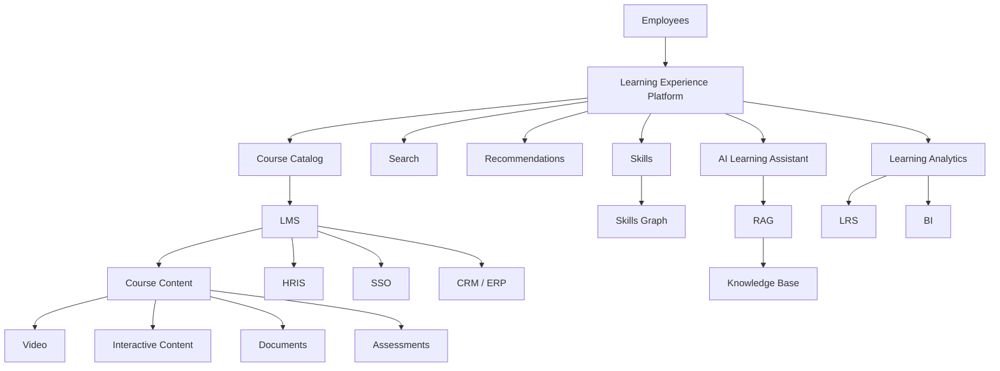
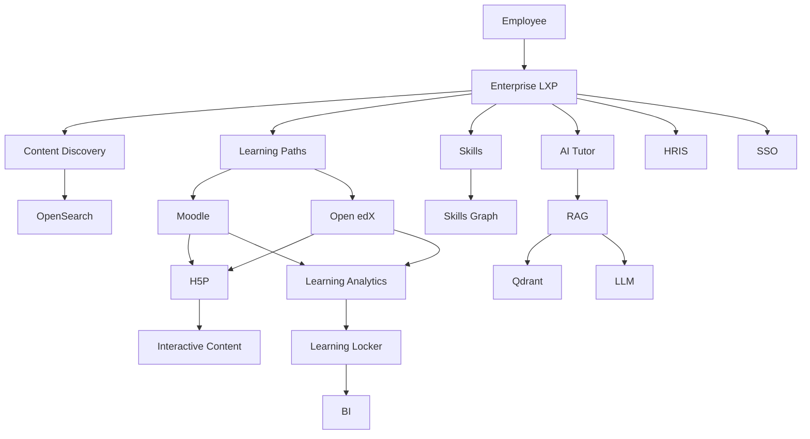

# Awesome-Learning-Content-Platform

# 🎓 Top Learning Content Platforms & Open-Source Learning Infrastructure


> A curated list of **enterprise learning content platforms, corporate learning libraries, skills platforms, learning experience platforms and open-source learning software**.


Modern enterprise learning platforms combine large content libraries with:


* Online courses

* Learning paths

* Skills frameworks

* Assessments

* Certifications

* Compliance training

* Video learning

* Interactive content

* Learning analytics

* Personalized recommendations

* AI-assisted learning

* LMS/LXP integrations

* SCORM / xAPI / LTI

* Content marketplaces

* Authoring tools

* Knowledge management


This repository focuses primarily on **open-source and self-hostable alternatives** to commercial learning-content platforms such as Go1, OpenSesame, Udemy Business, Coursera for Business, LinkedIn Learning, Skillsoft, Pluralsight, Cloud Academy, DataCamp and O'Reilly Learning.


A critical distinction is that commercial platforms often combine **software + proprietary content catalogs + content licensing + skills taxonomies + analytics**. Open-source software can reproduce much of the **platform infrastructure**, but not the proprietary course libraries themselves.


The open-source ecosystem is therefore best understood as a collection of composable layers:


```text

                    OPEN LEARNING STACK

                           │

        ┌──────────────────┼──────────────────┐

        │                  │                  │

        ▼                  ▼                  ▼

       LMS                LXP            Content Authoring

        │                  │                  │

        ▼                  ▼                  ▼

     Moodle            Open edX            H5P

     Canvas            Open Source         Adapt

     ILIAS             Discovery            BookStack

        │

        └──────────────────┬─────────────────┘

                           ▼

                    Content Repository

                           │

                           ▼

                    Learning Analytics

                           │

                           ▼

                  Skills / Competencies

                           │

                           ▼

                    Enterprise Systems

```


---


## 📑 Table of Contents


* [☁️ SaaS/Hosted Platforms](#️-saashosted-platforms)

* [🌍 Open-Source](#-open-source)

* [🏫 Open-Source Learning Management Systems](#-open-source-learning-management-systems)

* [🚀 Open-Source Learning Experience Platforms](#-open-source-learning-experience-platforms)

* [📚 Open-Source Course Authoring](#-open-source-course-authoring)

* [🎮 Open-Source Interactive Learning](#-open-source-interactive-learning)

* [🎥 Open-Source Video Learning](#-open-source-video-learning)

* [📖 Open-Source Knowledge & Documentation Platforms](#-open-source-knowledge--documentation-platforms)

* [🧠 Open-Source Skills & Competency Platforms](#-open-source-skills--competency-platforms)

* [📊 Open-Source Learning Analytics](#-open-source-learning-analytics)

* [🔗 Open Learning Standards](#-open-learning-standards)

* [🛒 Open Educational Resources](#-open-educational-resources)

* [🤖 Open-Source AI for Learning](#-open-source-ai-for-learning)

* [🧩 Commercial Platform → Open-Source Equivalent](#-commercial-platform--open-source-equivalent)

* [🏗️ Enterprise Learning Architecture](#️-enterprise-learning-architecture)

* [🔄 Open-Source Learning Platform Architecture](#-open-source-learning-platform-architecture)

* [📚 Open-Source Content Supply Chain](#-open-source-content-supply-chain)

* [📊 Commercial vs Open-Source](#-commercial-vs-open-source)

* [🚀 Recommended Open-Source Stacks](#-recommended-open-source-stacks)

* [🎯 Recommended Projects by Use Case](#-recommended-projects-by-use-case)

* [🏢 Building a Go1 Alternative](#-building-a-go1-alternative)

* [🎓 Building an Enterprise Learning Platform](#-building-an-enterprise-learning-platform)

* [🌐 Open-Source Learning Landscape](#-open-source-learning-landscape)

* [🧠 Why Open-Source Learning Infrastructure Matters](#-why-open-source-learning-infrastructure-matters)

* [🤝 Contributing](#-contributing)

* [⚠️ Disclaimer](#️-disclaimer)


---


# ☁️ SaaS/Hosted Platforms


Commercial learning-content platforms typically combine a hosted learning environment with proprietary course catalogs, content aggregation, skills intelligence and enterprise administration.


| Platform                                                                                                 | Company         | Primary Focus                    | Key Capabilities                                                                 |

| -------------------------------------------------------------------------------------------------------- | --------------- | -------------------------------- | -------------------------------------------------------------------------------- |

| [Go1](https://www.go1.com/)                                                                              | Go1             | Learning content aggregation     | Large multi-provider content catalog, compliance, skills and enterprise learning |

| [OpenSesame](https://www.opensesame.com/)                                                                | OpenSesame      | Learning content marketplace     | Curated enterprise content, compliance, skills and LMS integrations              |

| [Udemy Business](https://business.udemy.com/)                                                            | Udemy           | Enterprise learning              | Large course catalog, skills, learning paths and analytics                       |

| [Coursera for Business](https://www.coursera.org/business/)                                              | Coursera        | Enterprise learning              | University/company content, certificates, skills and learning paths              |

| [LinkedIn Learning](https://learning.linkedin.com/)                                                      | LinkedIn        | Professional learning            | Business, technology and creative courses, skills and integrations               |

| [Skillsoft](https://www.skillsoft.com/)                                                                  | Skillsoft       | Enterprise learning              | Percipio, leadership, compliance, technology and skills development              |

| [Pluralsight](https://www.pluralsight.com/)                                                              | Pluralsight     | Technology learning              | Software, cloud, IT, security and engineering content                            |

| [Cloud Academy](https://cloudacademy.com/)                                                               | Cloud Academy   | Cloud / IT training              | Cloud labs, courses, assessments and hands-on learning                           |

| [DataCamp for Business](https://www.datacamp.com/business)                                               | DataCamp        | Data skills                      | Data science, analytics, Python, SQL and AI learning                             |

| [O'Reilly Learning](https://www.oreilly.com/online-learning/)                                            | O'Reilly        | Technical learning               | Books, courses, videos, live events and interactive learning                     |

| [edX for Business](https://business.edx.org/)                                                            | edX             | Academic / professional learning | University courses, programs and professional certificates                       |

| [Udacity for Business](https://www.udacity.com/business)                                                 | Udacity         | Technical skills                 | Nanodegrees, projects and technical learning                                     |

| [Degreed](https://degreed.com/)                                                                          | Degreed         | Learning experience platform     | Content aggregation, skills and learning experience                              |

| [Cornerstone](https://www.cornerstoneondemand.com/)                                                      | Cornerstone     | Enterprise learning              | LMS, LXP, skills, content and talent management                                  |

| [Docebo](https://www.docebo.com/)                                                                        | Docebo          | Enterprise LMS / LXP             | AI learning, content, authoring and analytics                                    |

| [360Learning](https://360learning.com/)                                                                  | 360Learning     | Collaborative learning           | Course authoring, collaborative learning and enterprise training                 |

| [Fuse](https://www.fuseuniversal.com/)                                                                   | Fuse            | Learning experience              | Knowledge sharing, learning and content                                          |

| [LearnUpon](https://www.learnupon.com/)                                                                  | LearnUpon       | LMS                              | Enterprise learning management and content delivery                              |

| [Absorb LMS](https://www.absorblms.com/)                                                                 | Absorb Software | Enterprise LMS                   | Learning management, content and analytics                                       |

| [D2L Brightspace](https://www.d2l.com/brightspace/)                                                      | D2L             | Learning platform                | LMS, analytics, assessments and learning content                                 |

| [Blackboard](https://www.anthology.com/products/teaching-and-learning/learning-effectiveness/blackboard) | Anthology       | Learning platform                | LMS, content, assessment and analytics                                           |


Go1 describes its platform as providing organizations access to more than 100,000 learning resources from content providers through its premium catalog.


Coursera for Business combines courses, specializations, Professional Certificates, skills tracks and enterprise learning paths.


---


# 🌍 Open-Source


Unlike commercial content marketplaces, open-source learning infrastructure generally provides the **software layer** rather than a proprietary catalog of thousands of professionally produced courses.


The major building blocks include:


```text

                    OPEN-SOURCE LEARNING

                            │

       ┌────────────────────┼────────────────────┐

       │                    │                    │

       ▼                    ▼                    ▼

      LMS                  LXP              AUTHORING

       │                    │                    │

       ▼                    ▼                    ▼

    Moodle              Open edX             H5P

    Canvas              ILIAS                Adapt

    Sakai               OpenLearn            Xerte

    Chamilo

       │

       └────────────────────┬───────────────────┘

                            ▼

                     CONTENT LIBRARY

                            │

                 ┌──────────┴──────────┐

                 ▼                     ▼

             Video                 Documents

                 │                     │

                 └──────────┬──────────┘

                            ▼

                    Learning Analytics

                            │

                            ▼

                     Skills / L&D Data

```


---


# 🏫 Open-Source Learning Management Systems


## ⭐ Moodle


[Moodle](https://github.com/moodle/moodle) is one of the world's most widely used open-source learning platforms.


It supports:


* Courses

* Assignments

* Quizzes

* Forums

* Grades

* Competencies

* Certifications

* Learning plans

* Plugins

* Mobile learning

* Integrations

* Enterprise deployments


Moodle describes itself as free and open-source software and licenses its core under GPL.


| Project                                                             | Primary Focus                  | License                       |

| ------------------------------------------------------------------- | ------------------------------ | ----------------------------- |

| [Moodle](https://github.com/moodle/moodle)                          | General-purpose LMS            | GPL                           |

| [Open edX](https://github.com/openedx/openedx-platform)             | MOOCs / enterprise learning    | AGPL-3.0                      |

| [Canvas LMS](https://github.com/instructure/canvas-lms)             | Modern LMS                     | AGPL-3.0                      |

| [ILIAS](https://github.com/ILIAS-eLearning/ILIAS)                   | Enterprise / institutional LMS | GPL-3.0                       |

| [Sakai](https://github.com/sakaiproject/sakai)                      | Higher education LMS           | Educational Community License |

| [Chamilo](https://github.com/chamilo/chamilo-lms)                   | Lightweight LMS                | GPL-3.0+                      |

| [OpenOLAT](https://github.com/OpenOLAT/OpenOLAT)                    | LMS / learning platform        | Apache-2.0                    |

| [ATutor](https://github.com/atutor/ATutor)                          | Accessible LMS                 | GPL                           |

| [Forma LMS](https://github.com/formalms/forma)                      | Corporate LMS                  | GPL                           |

| [Claroline](https://github.com/claroline/Claroline)                 | Learning platform              | GPL                           |

| [OpenEduCat](https://github.com/openeducat/openeducat_erp)          | Education ERP + LMS            | LGPL / project-dependent      |

| [Frappe LMS](https://github.com/frappe/lms)                         | Modern LMS                     | GPL-3.0                       |

| [Sakai](https://www.sakailms.org/)                                  | Higher education               | ECL                           |

| [Gibbon](https://github.com/GibbonEdu/core)                         | School management / learning   | GPL-3.0                       |

| [Learning Locker](https://github.com/LearningLocker/learninglocker) | Learning Record Store          | AGPL-3.0                      |


Open edX combines an LMS with **Studio**, its learning-content authoring environment, and supports course delivery at scale.


Chamilo is another GPLv3+ open-source LMS with course management, multimedia, assignments, APIs and catalog functionality.


---


# 🚀 Open-Source Learning Experience Platforms


A Learning Experience Platform typically sits above one or more LMSs and focuses on:


* Content discovery

* Personalized learning

* Search

* Recommendations

* Skills

* Knowledge discovery

* Content aggregation

* User-generated content


| Project                                                    | Description                                               |

| ---------------------------------------------------------- | --------------------------------------------------------- |

| [Open edX](https://github.com/openedx/openedx-platform)    | Large-scale learning platform with authoring and delivery |

| [Moodle](https://github.com/moodle/moodle)                 | Extensible LMS that can be customized into an LXP         |

| [OpenOLAT](https://github.com/OpenOLAT/OpenOLAT)           | Learning platform with collaborative features             |

| [ILIAS](https://github.com/ILIAS-eLearning/ILIAS)          | Enterprise learning and knowledge platform                |

| [Frappe LMS](https://github.com/frappe/lms)                | Modern web-based LMS                                      |

| [Canvas LMS](https://github.com/instructure/canvas-lms)    | LMS with extensive integrations                           |

| [Sakai](https://github.com/sakaiproject/sakai)             | Higher-education learning platform                        |

| [OpenEduCat](https://github.com/openeducat/openeducat_erp) | Education management platform                             |


An open-source LXP can also be assembled from:


```text

LMS

+

Search Engine

+

Content Repository

+

Recommendation Engine

+

Skills Taxonomy

+

Analytics

+

AI Assistant

```


---


# 📚 Open-Source Course Authoring


Course authoring is one of the most important missing layers when attempting to reproduce a commercial learning-content ecosystem.


| Project                                                            | Description                               |

| ------------------------------------------------------------------ | ----------------------------------------- |

| [H5P](https://github.com/h5p/h5p-php-library)                      | Interactive HTML5 learning content        |

| [Adapt Learning](https://github.com/adaptlearning/adapt_framework) | Responsive e-learning authoring framework |

| [Xerte](https://github.com/xerte/xerte)                            | Open-source authoring tool                |

| [Open edX Studio](https://github.com/openedx/openedx-platform)     | Course authoring environment              |

| [Moodle](https://github.com/moodle/moodle)                         | Course authoring and management           |

| [eXeLearning](https://github.com/exelearning/iteexe)               | Authoring tool for educational content    |

| [GLO Maker](https://www.glomaker.org/)                             | Learning object authoring                 |

| [Lumi](https://github.com/Lumieducation/Lumi)                      | Desktop H5P authoring                     |

| [Oppia](https://github.com/oppia/oppia)                            | Interactive educational content           |


H5P supports interactive content and can integrate with LMS platforms including Moodle, Canvas, Open edX and others through supported integration mechanisms.


---


# 🎮 Open-Source Interactive Learning


Interactive content can provide a much richer experience than ordinary video courses.


```text

Traditional Course

      │

      ▼

   Video

      │

      ▼

   Quiz

      │

      ▼

 Certificate


Interactive Course

      │

      ▼

 Simulation

      │

      ├── Quiz

      ├── Drag & Drop

      ├── Branching Scenario

      ├── Interactive Video

      ├── Coding Exercise

      └── Game

      │

      ▼

 Adaptive Feedback

```


| Project                                                            | Interactive Capabilities                         |

| ------------------------------------------------------------------ | ------------------------------------------------ |

| [H5P](https://github.com/h5p/h5p-php-library)                      | Interactive video, quizzes, games, presentations |

| [Lumi](https://github.com/Lumieducation/Lumi)                      | H5P desktop authoring                            |

| [Adapt Learning](https://github.com/adaptlearning/adapt_framework) | Responsive interactive courses                   |

| [Xerte](https://github.com/xerte/xerte)                            | Interactive learning objects                     |

| [Oppia](https://github.com/oppia/oppia)                            | Interactive lessons                              |

| [Moodle](https://github.com/moodle/moodle)                         | Interactive activities through plugins           |

| [Open edX](https://github.com/openedx/openedx-platform)            | Interactive course components                    |


---


# 🎥 Open-Source Video Learning


Video represents a major component of commercial platforms such as LinkedIn Learning, Udemy Business, Coursera and O'Reilly.


Open-source infrastructure can provide the delivery layer:


| Project                                                                           | Role                          |

| --------------------------------------------------------------------------------- | ----------------------------- |

| [MediaCMS](https://github.com/mediacms-io/mediacms)                               | Open-source video platform    |

| [PeerTube](https://github.com/Chocobozzz/PeerTube)                                | Federated video platform      |

| [Kaltura Community Edition](https://github.com/kaltura/platform-install-packages) | Video platform components     |

| [Owncast](https://github.com/owncast/owncast)                                     | Self-hosted live video        |

| [Jellyfin](https://github.com/jellyfin/jellyfin)                                  | Media server                  |

| [BigBlueButton](https://github.com/bigbluebutton/bigbluebutton)                   | Open-source virtual classroom |

| [Jitsi Meet](https://github.com/jitsi/jitsi-meet)                                 | Video conferencing            |

| [MediaMTX](https://github.com/bluenviron/mediamtx)                                | Media streaming server        |


A self-hosted learning-video stack can therefore look like:


```text

Course Platform

      │

      ▼

Video CMS

      │

      ▼

Object Storage

      │

      ▼

Transcoding

      │

      ▼

CDN

      │

      ▼

Learner

```


---


# 📖 Open-Source Knowledge & Documentation Platforms


Learning content does not always need to be packaged as a formal course.


Enterprise learning ecosystems increasingly combine:


* Courses

* Documentation

* Internal knowledge

* Tutorials

* Wikis

* Runbooks

* Technical books

* FAQs


| Project                                                              | Focus                    |

| -------------------------------------------------------------------- | ------------------------ |

| [BookStack](https://github.com/BookStackApp/BookStack)               | Knowledge base           |

| [Wiki.js](https://github.com/requarks/wiki)                          | Enterprise wiki          |

| [Docusaurus](https://github.com/facebook/docusaurus)                 | Documentation sites      |

| [MkDocs](https://github.com/mkdocs/mkdocs)                           | Documentation            |

| [Material for MkDocs](https://github.com/squidfunk/mkdocs-material)  | Documentation / learning |

| [GitBook-style OSS alternatives](https://github.com/outline/outline) | Knowledge management     |

| [Outline](https://github.com/outline/outline)                        | Team knowledge base      |

| [MediaWiki](https://github.com/wikimedia/mediawiki)                  | Collaborative knowledge  |

| [Documenso](https://github.com/documenso/documenso)                  | Document workflows       |


---


# 🧠 Open-Source Skills & Competency Platforms


Skills-based learning requires a layer connecting:


```text

Job

 │

 ▼

Role

 │

 ▼

Skills

 │

 ▼

Competencies

 │

 ▼

Learning Content

 │

 ▼

Assessment

 │

 ▼

Skill Evidence

```


Useful open-source building blocks include:


| Project / Technology                                           | Role                               |

| -------------------------------------------------------------- | ---------------------------------- |

| [Moodle](https://github.com/moodle/moodle)                     | Competencies and learning plans    |

| [Open edX](https://github.com/openedx/openedx-platform)        | Learning pathways and learner data |

| [ILIAS](https://github.com/ILIAS-eLearning/ILIAS)              | Competency management              |

| [Frappe HR](https://github.com/frappe/hrms)                    | HR / employee data                 |

| [Keycloak](https://github.com/keycloak/keycloak)               | Identity                           |

| [OpenSearch](https://github.com/opensearch-project/OpenSearch) | Skills/content search              |

| PostgreSQL                                                     | Skills and competency data         |

| Neo4j Community                                                | Skills graphs / knowledge graphs   |


---


# 📊 Open-Source Learning Analytics


Learning analytics transforms raw activity into insights.


```text

Learner Activity

      │

      ▼

Learning Record

      │

      ▼

Event Pipeline

      │

      ▼

Learning Record Store

      │

      ▼

Analytics

      │

      ├── Completion

      ├── Engagement

      ├── Skill Progress

      ├── Assessment

      └── Learning Outcomes

```


| Project                                                             | Role                      |

| ------------------------------------------------------------------- | ------------------------- |

| [Learning Locker](https://github.com/LearningLocker/learninglocker) | Learning Record Store     |

| [Moodle](https://github.com/moodle/moodle)                          | Native learning analytics |

| [Open edX](https://github.com/openedx/openedx-platform)             | Learner analytics         |

| [Apache Superset](https://github.com/apache/superset)               | BI / analytics            |

| [Metabase](https://github.com/metabase/metabase)                    | BI / dashboards           |

| [Grafana](https://github.com/grafana/grafana)                       | Metrics visualization     |

| [ClickHouse](https://github.com/ClickHouse/ClickHouse)              | Large-scale analytics     |

| [PostgreSQL](https://www.postgresql.org/)                           | Analytics storage         |


---


# 🔗 Open Learning Standards


Standards are critical when connecting an open-source learning stack.


| Standard              | Purpose                              |

| --------------------- | ------------------------------------ |

| **SCORM**             | Packaging and tracking e-learning    |

| **xAPI**              | Learning activity statements         |

| **cmi5**              | xAPI-based learning interoperability |

| **LTI**               | Connecting learning tools and LMSs   |

| **OneRoster**         | Roster / class data interoperability |

| **QTI**               | Assessment interoperability          |

| **Caliper Analytics** | Learning analytics events            |

| **Open Badges**       | Digital credentials                  |

| **CLR**               | Comprehensive learner records        |


These standards allow content and learning applications to move across platforms instead of becoming locked to a single LMS.


---


# 🛒 Open Educational Resources


Open-source software and open educational content are separate concepts.


Useful open-content ecosystems include:


| Resource                                     | Focus                                  |

| -------------------------------------------- | -------------------------------------- |

| [OpenStax](https://openstax.org/)            | Open textbooks                         |

| [MIT OpenCourseWare](https://ocw.mit.edu/)   | University course materials            |

| [OpenLearn](https://www.open.edu/openlearn/) | Open educational resources             |

| [OER Commons](https://oercommons.org/)       | Open educational resources             |

| [Wikibooks](https://www.wikibooks.org/)      | Open textbooks                         |

| [Wikiversity](https://www.wikiversity.org/)  | Open learning                          |

| [Khan Academy](https://www.khanacademy.org/) | Free educational content               |

| [LibreTexts](https://libretexts.org/)        | Open textbooks / educational resources |


These are **content resources**, not necessarily open-source software projects.


---


# 🤖 Open-Source AI for Learning


AI can turn a traditional LMS into an AI-powered learning platform.


```text

                     Learner

                        │

                        ▼

                  AI Learning Agent

                        │

          ┌─────────────┼─────────────┐

          ▼             ▼             ▼

      Course Search   Tutor        Assessment

          │             │             │

          ▼             ▼             ▼

       Content        LLM/RAG       Feedback

                        │

                        ▼

                  Personalized Path

```


Useful open-source building blocks:


| Project                                                        | Role                     |

| -------------------------------------------------------------- | ------------------------ |

| [Haystack](https://github.com/deepset-ai/haystack)             | RAG / AI pipelines       |

| [LlamaIndex](https://github.com/run-llama/llama_index)         | Knowledge retrieval      |

| [LangChain](https://github.com/langchain-ai/langchain)         | LLM applications         |

| [Open WebUI](https://github.com/open-webui/open-webui)         | Self-hosted AI interface |

| [Ollama](https://github.com/ollama/ollama)                     | Local LLM runtime        |

| [vLLM](https://github.com/vllm-project/vllm)                   | LLM inference            |

| [Qdrant](https://github.com/qdrant/qdrant)                     | Vector database          |

| [Weaviate](https://github.com/weaviate/weaviate)               | Vector search            |

| [Milvus](https://github.com/milvus-io/milvus)                  | Vector database          |

| [OpenSearch](https://github.com/opensearch-project/OpenSearch) | Search / vector search   |


---


# 🧩 Commercial Platform → Open-Source Equivalent


| Commercial Platform               | Open-Source Equivalent / Building Blocks                   |

| --------------------------------- | ---------------------------------------------------------- |

| **Go1**                           | Moodle / Open edX + H5P + OpenSearch + content aggregation |

| **OpenSesame**                    | Moodle / Open edX + content marketplace + H5P              |

| **Udemy Business**                | Open edX + Moodle + H5P + PeerTube / MediaCMS              |

| **Coursera for Business**         | Open edX + H5P + Open Badges + OpenSearch                  |

| **LinkedIn Learning**             | Moodle / Open edX + MediaCMS + H5P + skills graph          |

| **Skillsoft / Percipio**          | Open edX + Moodle + knowledge base + AI/RAG                |

| **Pluralsight**                   | Open edX + H5P + video platform + coding labs              |

| **Cloud Academy**                 | Open edX + Moodle + coding/sandbox infrastructure          |

| **DataCamp for Business**         | Moodle / Open edX + JupyterHub + coding environments       |

| **O'Reilly Learning**             | Open edX + BookStack + video + interactive labs            |

| **edX for Business**              | Open edX                                                   |

| **Enterprise LMS**                | Moodle / Open edX / Canvas / ILIAS                         |

| **Enterprise LXP**                | Open edX + OpenSearch + recommendation engine              |

| **Corporate Knowledge Platform**  | Outline / BookStack / Wiki.js + LMS                        |

| **Interactive Learning Platform** | H5P + Moodle / Open edX                                    |

| **AI Learning Platform**          | Moodle / Open edX + RAG + LLM + vector DB                  |


---


# 🏗️ Enterprise Learning Architecture





---


# 🔄 Open-Source Learning Platform Architecture


A practical self-hosted architecture can combine:


```text

                         EMPLOYEE

                            │

                            ▼

                   Learning Experience

                            │

             ┌──────────────┼──────────────┐

             ▼              ▼              ▼

           Moodle        Open edX       Custom LXP

             │              │              │

             └──────────────┼──────────────┘

                            ▼

                      Content Layer

                            │

          ┌─────────────────┼─────────────────┐

          ▼                 ▼                 ▼

        H5P              Video              Books

          │                 │                 │

          ▼                 ▼                 ▼

       Courses          MediaCMS          BookStack

                            │

                            ▼

                     Search / Discovery

                            │

                         OpenSearch

                            │

                            ▼

                      AI / RAG Layer

                            │

                   ┌────────┴────────┐

                   ▼                 ▼

                  LLM              Vector DB

                            │

                            ▼

                       Analytics

```


---


# 📚 Open-Source Content Supply Chain


A commercial content platform depends heavily on content acquisition.


An open-source ecosystem can instead create a content supply chain:


```text

                    CONTENT SOURCES

                          │

       ┌──────────────────┼──────────────────┐

       ▼                  ▼                  ▼

   Open Courses       Internal Docs      Authors

       │                  │                  │

       └──────────────────┼──────────────────┘

                          ▼

                  Content Repository

                          │

                          ▼

                    Authoring Tools

                          │

                          ▼

                  H5P / SCORM / HTML

                          │

                          ▼

                       LMS/LXP

                          │

                          ▼

                      Learners

```


---


# 🧪 Technical Learning Architecture


For platforms competing with Pluralsight, Cloud Academy or DataCamp, traditional LMS software is not enough.


A technical learning stack can add interactive computing environments:


```text

                 Technical Course

                       │

                       ▼

                  LMS / LXP

                       │

          ┌────────────┼────────────┐

          ▼            ▼            ▼

       Video        Reading       Exercise

                                     │

                                     ▼

                               JupyterHub

                                     │

                                     ▼

                              Docker / K8s

                                     │

                                     ▼

                               Live Sandbox

                                     │

                                     ▼

                                  Grade

```


Useful projects:


| Project                                                | Role                           |

| ------------------------------------------------------ | ------------------------------ |

| [JupyterHub](https://github.com/jupyterhub/jupyterhub) | Multi-user coding environment  |

| [JupyterLab](https://github.com/jupyterlab/jupyterlab) | Interactive notebooks          |

| [Coder](https://github.com/coder/coder)                | Cloud development environments |

| [GitLab](https://github.com/gitlabhq/gitlabhq)         | Git / CI / project work        |

| [GitHub Classroom](https://github.com/classroom)       | Educational coding workflows   |

| [Code-Server](https://github.com/coder/code-server)    | Browser-based VS Code          |

| [Judge0](https://github.com/judge0/judge0)             | Code execution / assessment    |


---


# 🧑‍💻 DataCamp-Style Open-Source Stack


A data-learning platform can be built from:


```text

                    Learner

                       │

                       ▼

                 Moodle / Open edX

                       │

                       ▼

                Interactive Lesson

                       │

              ┌────────┴────────┐

              ▼                 ▼

          JupyterLab         H5P

              │                 │

              ▼                 ▼

          Python / R         Quizzes

              │

              ▼

           JupyterHub

              │

              ▼

       Docker / Kubernetes

              │

              ▼

         Automated Grading

```


Recommended components:


```text

Open edX / Moodle

+

JupyterHub

+

JupyterLab

+

Judge0

+

H5P

+

PostgreSQL

+

Object Storage

```


---


# 📖 O'Reilly-Style Open-Source Stack


For technical books, documentation and video learning:


```text

              Technical Content

                     │

       ┌─────────────┼─────────────┐

       ▼             ▼             ▼

     Books         Video        Courses

       │             │             │

   BookStack      MediaCMS     Open edX

       │             │             │

       └─────────────┼─────────────┘

                     ▼

                OpenSearch

                     │

                     ▼

                AI / RAG

                     │

                     ▼

              Learning Assistant

```


Possible stack:


```text

BookStack

+

MediaCMS

+

Open edX

+

H5P

+

OpenSearch

+

Qdrant

+

LlamaIndex

+

Ollama / vLLM

```


---


# 🏢 Building a Go1 Alternative


Go1 is fundamentally a **content aggregation and enterprise learning platform**, so a comparable open-source architecture should separate:


```text

Content

+

Catalog

+

Learning Platform

+

Search

+

Recommendations

+

Skills

+

Analytics

```


Architecture:


```text

                         EMPLOYEE

                            │

                            ▼

                       Custom LXP

                            │

              ┌─────────────┼─────────────┐

              ▼             ▼             ▼

          Catalog         Search       Skills

              │             │             │

              ▼             ▼             ▼

         Content DB     OpenSearch     Skill Graph

              │

       ┌──────┼──────┐

       ▼      ▼      ▼

    Moodle  Open edX H5P

       │      │      │

       └──────┼──────┘

              ▼

          Analytics

              │

              ▼

              LRS

```


### Suggested Components


```text

LXP                → Custom React / Next.js

LMS                → Moodle / Open edX

Authoring          → H5P / Xerte / Adapt

Video              → MediaCMS / PeerTube

Knowledge          → BookStack / Wiki.js

Search             → OpenSearch

Vector Search      → Qdrant

AI                  → Ollama / vLLM

RAG                → Haystack / LlamaIndex

Analytics          → Learning Locker + Superset

Identity           → Keycloak

Database            → PostgreSQL

Object Storage      → MinIO

Workflow            → Temporal

```


---


# 🎓 Building an Enterprise Learning Platform





---


# ⚖️ Commercial vs Open-Source


| Capability                | Commercial Learning Platform | Open-Source Stack         |

| ------------------------- | ---------------------------- | ------------------------- |

| LMS                       | ✅                            | ✅                         |

| Course Authoring          | ✅                            | ✅                         |

| Content Catalog           | ✅                            | ⚠️ Must build / aggregate |

| Proprietary Courses       | ✅                            | ❌                         |

| Video Learning            | ✅                            | ✅                         |

| Interactive Learning      | ✅                            | ✅                         |

| Learning Paths            | ✅                            | ✅                         |

| Skills                    | ✅                            | ⚠️ Build / integrate      |

| AI Tutor                  | Increasingly                 | ✅ Build / integrate       |

| Search                    | ✅                            | ✅                         |

| Recommendations           | ✅                            | Build / integrate         |

| Learning Analytics        | ✅                            | ✅                         |

| Certifications            | ✅                            | ✅                         |

| Assessments               | ✅                            | ✅                         |

| Coding Labs               | Some                         | ✅ Build / integrate       |

| Cloud Labs                | Some                         | Build                     |

| Content Marketplace       | ✅                            | Build / integrate         |

| Content Licensing         | ✅                            | ❌                         |

| Self Hosting              | Usually limited              | ✅                         |

| Data Ownership            | Vendor-dependent             | Full control              |

| Customization             | Medium / High                | Very High                 |

| Vendor Lock-in            | Higher                       | Lower                     |

| Infrastructure            | Managed                      | Self-managed              |

| Enterprise SSO            | ✅                            | ✅                         |

| SCORM                     | ✅                            | ✅                         |

| xAPI                      | ✅                            | ✅                         |

| LTI                       | ✅                            | ✅                         |

| Open Source               | Usually ❌                    | ✅                         |

| Implementation Complexity | Lower                        | Higher                    |


---


# 📊 Learning Platform Comparison


| Project         | LMS | Authoring | Video | Interactive | Analytics | AI/RAG | Self-Host |

| --------------- | :-: | :-------: | :---: | :---------: | :-------: | :----: | :-------: |

| Moodle          |  ✅  |     ✅     |   ⚠️  |      ✅      |     ✅     |   ⚠️   |     ✅     |

| Open edX        |  ✅  |     ✅     |   ✅   |      ✅      |     ✅     |   ⚠️   |     ✅     |

| Canvas LMS      |  ✅  |     ✅     |   ⚠️  |      ✅      |     ✅     |   ⚠️   |     ✅     |

| ILIAS           |  ✅  |     ✅     |   ⚠️  |      ✅      |     ✅     |   ⚠️   |     ✅     |

| Sakai           |  ✅  |     ✅     |   ⚠️  |      ✅      |     ✅     |   ⚠️   |     ✅     |

| Chamilo         |  ✅  |     ✅     |   ⚠️  |      ✅      |     ✅     |   ⚠️   |     ✅     |

| OpenOLAT        |  ✅  |     ✅     |   ⚠️  |      ✅      |     ✅     |   ⚠️   |     ✅     |

| Frappe LMS      |  ✅  |     ✅     |   ⚠️  |      ⚠️     |     ⚠️    |   ⚠️   |     ✅     |

| H5P             |  ❌  |     ✅     |   ⚠️  |      ✅      |     ⚠️    |    ❌   |     ✅     |

| Adapt           |  ❌  |     ✅     |   ⚠️  |      ✅      |     ⚠️    |    ❌   |     ✅     |

| Xerte           |  ❌  |     ✅     |   ⚠️  |      ✅      |     ⚠️    |    ❌   |     ✅     |

| MediaCMS        |  ❌  |     ❌     |   ✅   |      ⚠️     |     ⚠️    |    ❌   |     ✅     |

| Learning Locker |  ❌  |     ❌     |   ❌   |      ❌      |     ✅     |    ❌   |     ✅     |

| BookStack       |  ❌  |     ✅     |   ⚠️  |      ⚠️     |     ⚠️    |    ❌   |     ✅     |

| JupyterHub      |  ❌  |     ❌     |   ⚠️  |      ✅      |     ⚠️    |    ❌   |     ✅     |


---


# 🎯 Recommended Projects by Use Case


| Use Case                                     | Recommended Starting Point                       |

| -------------------------------------------- | ------------------------------------------------ |

| General enterprise LMS                       | **Moodle**                                       |

| Large-scale online learning                  | **Open edX**                                     |

| MOOC platform                                | **Open edX**                                     |

| Corporate training                           | **Moodle / Open edX**                            |

| Interactive content                          | **H5P**                                          |

| Course authoring                             | **H5P / Adapt / Xerte**                          |

| Lightweight LMS                              | **Chamilo**                                      |

| European enterprise / institutional learning | **ILIAS**                                        |

| Higher education                             | **Sakai / Open edX / Moodle**                    |

| Knowledge management                         | **BookStack / Wiki.js / Outline**                |

| Open-source video learning                   | **MediaCMS / PeerTube**                          |

| Learning analytics                           | **Learning Locker**                              |

| Technical training                           | **Open edX + JupyterHub**                        |

| Data science training                        | **Moodle + JupyterHub**                          |

| Coding education                             | **JupyterHub + Judge0**                          |

| AI learning assistant                        | **Open edX / Moodle + RAG + LLM**                |

| Content search                               | **OpenSearch**                                   |

| AI-powered content search                    | **OpenSearch + Qdrant + LlamaIndex**             |

| Enterprise knowledge learning                | **BookStack + Moodle + OpenSearch**              |

| Go1-style platform                           | **Open edX + Moodle + OpenSearch + H5P**         |

| Coursera-style platform                      | **Open edX**                                     |

| Udemy-style platform                         | **Open edX + H5P + MediaCMS**                    |

| LinkedIn Learning-style platform             | **Moodle + MediaCMS + OpenSearch**               |

| Pluralsight-style platform                   | **Open edX + JupyterHub + coding labs**          |

| O'Reilly-style platform                      | **Open edX + BookStack + MediaCMS + OpenSearch** |


---


# 🌐 Open-Source Learning Landscape


```mermaid

mindmap

  root((Open-Source Learning))

    LMS

      Moodle

      Open edX

      Canvas

      ILIAS

      Sakai

      Chamilo

      OpenOLAT

      Frappe LMS

      Forma LMS

    Authoring

      H5P

      Adapt

      Xerte

      Lumi

      eXeLearning

      Open edX Studio

    Interactive

      H5P

      Oppia

      Adapt

      Xerte

    Video

      MediaCMS

      PeerTube

      Kaltura

      Owncast

      BigBlueButton

      Jitsi

    Knowledge

      BookStack

      Wiki.js

      Outline

      MediaWiki

      Docusaurus

      MkDocs

    Analytics

      Learning Locker

      Superset

      Metabase

      Grafana

      ClickHouse

    Standards

      SCORM

      xAPI

      cmi5

      LTI

      QTI

      Caliper

      Open Badges

    AI

      Haystack

      LlamaIndex

      LangChain

      Ollama

      vLLM

      Qdrant

      Weaviate

      Milvus

    Technical Learning

      JupyterHub

      JupyterLab

      Judge0

      Coder

      Code Server

    Content

      OpenStax

      MIT OCW

      OpenLearn

      OER Commons

      Wikiversity

```


---


# 🧠 Why Open-Source Learning Infrastructure Matters


Commercial learning platforms provide tremendous value because they combine software with:


```text

Software

+

Content

+

Content Licensing

+

Skills Taxonomy

+

Search

+

Recommendations

+

Analytics

+

Enterprise Integrations

```


Open-source projects can provide most of the **software infrastructure**, but organizations still need to source or create the content.


That leads to a different architecture:


```text

             COMMERCIAL MODEL


        Platform + Content Catalog

                  │

                  ▼

              Learner


             OPEN-SOURCE MODEL


             Open Platform

                  │

        ┌─────────┼─────────┐

        ▼         ▼         ▼

     Open OER   Internal   Licensed

     Content    Content    Content

        │         │         │

        └─────────┼─────────┘

                  ▼

              Learning

               Platform

                  │

                  ▼

               Learner

```


This provides organizations with greater control over:


* Infrastructure

* Data

* Branding

* Learning workflows

* Integrations

* Content

* AI models

* Search

* Analytics

* Deployment

* Data residency


---


# 🔥 Open-Source Enterprise Learning Reference Stack


A strong general-purpose architecture is:


```text

                         EMPLOYEES

                            │

                            ▼

                       CUSTOM LXP

                            │

             ┌──────────────┼──────────────┐

             ▼              ▼              ▼

          SEARCH         SKILLS           AI

             │              │              │

       OpenSearch       Skill Graph       RAG

             │              │              │

             └──────────────┼──────────────┘

                            ▼

                     CONTENT CATALOG

                            │

             ┌──────────────┼──────────────┐

             ▼              ▼              ▼

          Moodle         Open edX        H5P

             │              │              │

             └──────────────┼──────────────┘

                            ▼

                       VIDEO / DOCS

                            │

                   ┌────────┴────────┐

                   ▼                 ▼

                MediaCMS          BookStack

                   │

                   ▼

                 LRS

                   │

                   ▼

             Learning Analytics

                   │

                   ▼

                 BI / HR

```


---


# 🧩 Commercial Learning Platform → OSS Architecture


```text

Go1

 │

 ├── Content Aggregation → OpenSearch + Content Connectors

 ├── LMS                 → Moodle / Open edX

 ├── Interactive Content → H5P

 ├── Search              → OpenSearch

 ├── AI                  → Haystack + LLM

 └── Analytics           → Learning Locker + Superset


Udemy Business

 │

 ├── Course Platform     → Open edX

 ├── Authoring           → H5P

 ├── Video               → MediaCMS

 ├── Search              → OpenSearch

 └── Analytics           → Learning Locker


Coursera for Business

 │

 ├── LMS                 → Open edX

 ├── Authoring           → Open edX Studio

 ├── Credentials         → Open Badges

 ├── Search              → OpenSearch

 └── Analytics           → Open edX + LRS


LinkedIn Learning

 │

 ├── LMS                 → Moodle / Open edX

 ├── Video               → MediaCMS

 ├── Search              → OpenSearch

 ├── Knowledge           → BookStack

 └── AI                  → RAG + LLM


Pluralsight

 │

 ├── LMS                 → Open edX

 ├── Video               → MediaCMS

 ├── Labs                → JupyterHub / Coder

 ├── Coding Assessment   → Judge0

 └── Analytics           → Learning Locker


DataCamp

 │

 ├── LMS                 → Moodle / Open edX

 ├── Interactive Coding  → JupyterHub

 ├── Exercises            → Judge0

 ├── Content             → H5P

 └── Analytics           → Learning Locker


O'Reilly

 │

 ├── Books               → BookStack

 ├── Courses             → Open edX

 ├── Video               → MediaCMS

 ├── Search              → OpenSearch

 └── AI                  → RAG + LLM

```


---


# 🚀 Minimal Self-Hosted Enterprise Learning Platform


For an initial deployment:


```text

Moodle

+

H5P

+

PostgreSQL

+

Keycloak

+

MinIO

+

OpenSearch

+

Learning Locker

```


For technical learning:


```text

Moodle / Open edX

+

H5P

+

JupyterHub

+

Judge0

+

MediaCMS

```


For AI-powered learning:


```text

Moodle / Open edX

+

OpenSearch

+

Qdrant

+

LlamaIndex / Haystack

+

Ollama / vLLM

+

Open LLM

```


---


# 🏆 Full Open-Source Learning Content Stack


```text

┌──────────────────────────────────────────────┐

│                 LEARNER                      │

└──────────────────────┬───────────────────────┘

                       │

┌──────────────────────▼───────────────────────┐

│                    LXP                       │

│       Search • Skills • Recommendations      │

└──────────────────────┬───────────────────────┘

                       │

        ┌──────────────┼──────────────┐

        ▼              ▼              ▼

     Moodle         Open edX        Custom

        │              │             LXP

        └──────────────┼──────────────┘

                       ▼

                 H5P / Authoring

                       │

          ┌────────────┼────────────┐

          ▼            ▼            ▼

        Video        Books       Exercises

          │            │            │

      MediaCMS      BookStack    JupyterHub

          │                         │

          └────────────┬────────────┘

                       ▼

                    Search

                  OpenSearch

                       │

                       ▼

                 AI / RAG Layer

                       │

               ┌───────┴────────┐

               ▼                ▼

             Qdrant          LLM

               │                │

               └───────┬────────┘

                       ▼

                AI Learning Agent

                       │

                       ▼

                  Analytics

                       │

                  Learning Locker

                       │

                       ▼

                 BI / HRIS

```


---


# 🤝 Contributing


Contributions are welcome!


Please consider adding:


* Open-source LMS platforms

* Learning experience platforms

* Course authoring tools

* Interactive learning frameworks

* Video-learning platforms

* Learning analytics systems

* Learning Record Stores

* Skills / competency systems

* Digital credential platforms

* Open educational resources

* Coding-learning infrastructure

* Virtual labs

* Assessment engines

* AI tutoring systems

* RAG learning assistants

* Learning recommendation systems

* Content management systems

* Knowledge-management platforms

* SCORM / xAPI / LTI tooling

* Open-source educational content


When adding a project, distinguish between:


* **Open-source software**

* **Open-core software**

* **Source-available software**

* **Open educational resources**

* **Commercial hosted platforms**

* **Commercial platforms built on open-source software**


An open educational resource is not automatically an open-source software project, and an open-source LMS does not automatically include an open course catalog.


---


# ⚠️ Disclaimer


This repository is an independent technical curation and is **not affiliated with or endorsed by any company or project listed here**.


Commercial learning platforms and open-source LMS/LXP software solve overlapping but different problems.


A platform such as Go1, OpenSesame, Udemy Business, Coursera for Business, LinkedIn Learning or O'Reilly combines software with **licensed proprietary learning content**.


Open-source platforms such as Moodle and Open edX primarily provide the software infrastructure. Open edX includes both its LMS and Studio authoring environment, while Moodle provides a broad extensible LMS ecosystem.


Therefore, building an open-source equivalent to a commercial learning-content platform generally requires assembling:


```text

Learning Platform

+

Content Authoring

+

Content Repository

+

Video Infrastructure

+

Interactive Learning

+

Search

+

Skills

+

Analytics

+

AI

+

Content Licensing / OER

```


Always verify the current license of each project before commercial deployment. Licenses can differ between source code, plugins, extensions, content, model weights and hosted services.


---


## ⭐ Star This Repository


If you are interested in:


* Learning Platforms

* Learning Management Systems

* Learning Experience Platforms

* Corporate Learning

* Enterprise Training

* EdTech

* Open-Source Education

* Open Educational Resources

* AI Learning

* Skills Intelligence

* Learning Analytics

* Knowledge Management

* Technical Training


consider giving this repository a ⭐ **Star** and contributing new projects.


---


**Last updated: September 2026**
