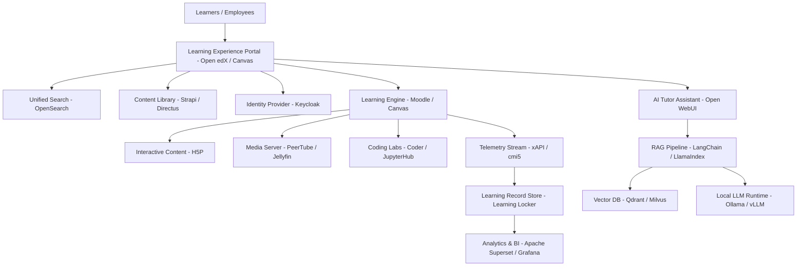

# 🎓 Awesome Learning Content Platform & Open-Source Infrastructure


<p align="center">
  <a href="https://github.com/ishandutta2007/Awesome-Awesome-Awesome"></a>
  <a href="https://discord.gg/jc4xtF58Ve"></a>
  <a href="https://github.com/ishandutta2007/Awesome-Learning-Content-Platform/blob/main/LICENSE"></a>
  <a href="https://github.com/ishandutta2007/Awesome-Learning-Content-Platform/stargazers"></a>
  <a href="https://github.com/ishandutta2007/Awesome-Learning-Content-Platform/network/members"></a>
  <a href="https://github.com/ishandutta2007"></a>
</p>

> A comprehensive, SEO-optimized curated directory of **enterprise SaaS learning content platforms, corporate training libraries, skills taxonomies, Learning Experience Platforms (LXP), Learning Management Systems (LMS), and open-source learning infrastructure**.

---

## 💡 Overview & Key Capabilities

Modern enterprise learning platforms combine large content libraries with modular technology infrastructure:

* 📚 **Online Courses & Learning Paths** – Curated tracks for software development, cloud, AI, business, and compliance.
* 🎯 **Skills Frameworks & Competencies** – Role-based skill taxonomies and automated gap analyses.
* 📝 **Assessments & Certifications** – Automated quizzes, coding sandboxes, proctored exams, and digital credentials.
* 📜 **Compliance & SCORM / xAPI** – Standardized tracking and regulatory compliance training.
* 🎥 **Video & Interactive Learning** – High-definition streaming, interactive H5P, live virtual classrooms, and simulations.
* 📊 **Learning Analytics & LRS** – Deep telemetry tracking with Learning Record Stores and BI dashboards.
* 🤖 **AI-Assisted Learning & RAG** – Intelligent tutoring agents, personalized recommendations, and instant knowledge retrieval.

This repository provides an exhaustive comparison of commercial hosted SaaS solutions alongside **self-hostable open-source alternatives** (e.g., Go1, OpenSesame, Udemy Business, Coursera for Business, LinkedIn Learning, Skillsoft, Pluralsight, Cloud Academy, DataCamp, and O'Reilly Learning).

---

## 📌 Open Learning Stack Architecture

```text
                    OPEN LEARNING STACK ARCHITECTURE
                                   │
        ┌──────────────────────────┼──────────────────────────┐
        │                          │                          │
        ▼                          ▼                          ▼
       LMS                        LXP                 Content Authoring
        │                          │                          │
        ▼                          ▼                          ▼
     Moodle                    Open edX                      H5P
     Canvas                    OpenOLAT                     Adapt
     ILIAS                     Frappe LMS                 BookStack
        │                          │                          │
        └──────────────────────────┼──────────────────────────┘
                                   │
                                   ▼
                         Content Repository & RAG
                                   │
                                   ▼
                         Learning Analytics & LRS
                                   │
                                   ▼
                         Skills Graph & Enterprise HR
```

---

## 📑 Table of Contents

* [☁️ SaaS / Hosted Enterprise Platforms](#️-saas--hosted-enterprise-platforms)
* [🏫 Open-Source Learning Management Systems (LMS)](#-open-source-learning-management-systems-lms)
* [🚀 Open-Source Learning Experience Platforms (LXP)](#-open-source-learning-experience-platforms-lxp)
* [📚 Open-Source Course Authoring & Interactive Learning](#-open-source-course-authoring--interactive-learning)
* [🎥 Open-Source Video Learning & Streaming](#-open-source-video-learning--streaming)
* [📖 Open-Source Knowledge & Documentation Platforms](#-open-source-knowledge--documentation-platforms)
* [🧠 Open-Source Skills & Competency Frameworks](#-open-source-skills--competency-frameworks)
* [📊 Open-Source Learning Analytics & LRS](#-open-source-learning-analytics--lrs)
* [🤖 Open-Source AI for Learning & RAG](#-open-source-ai-for-learning--rag)
* [🔗 Open Learning Standards & Protocols](#-open-learning-standards--protocols)
* [🛒 Open Educational Resources (OER)](#-open-educational-resources-oer)
* [🧩 Commercial Platform → Open-Source Equivalents](#-commercial-platform--open-source-equivalents)
* [🏗️ Enterprise Architecture & Deployment Stacks](#️-enterprise-architecture--deployment-stacks)
* [🤝 Contributing](#-contributing)
* [📈 Star History](#-star-history)

---

# ☁️ SaaS / Hosted Enterprise Platforms

> 📈 **Market Size & Industry Dynamics**: The global Corporate Learning & Enterprise LMS market size is estimated at **$28.5 Billion in 2024** and is projected to reach **$65.2 Billion by 2030** (CAGR of ~14.2%). The sector is **highly fragmented**, characterized by hundreds of specialized point solutions (LMS, LXP, content aggregators, coding sandboxes) without a single dominant winner-take-all monopoly.

Below is the structured breakdown of leading commercial SaaS learning content platforms, sorted by **Company Size / Valuation (Descending)**:

| Platform | Company | Revenue / Valuation | Primary Focus | Starting Pricing | Free Tier / Trial Limit | Key Capabilities |
| :--- | :--- | :--- | :--- | :--- | :--- | :--- |
| 💼 [LinkedIn Learning](https://learning.linkedin.com/) | LinkedIn (Microsoft) | ~$15.0B Rev / $3.0T Valuation | Professional & Enterprise Learning | **$39.99 / month** ($19.99/mo annual) | **1-month free trial** (Full access to 20,000+ courses) | Premium content, skill evaluations, LinkedIn profile certificates |
| 🏫 [Blackboard](https://www.anthology.com/products/teaching-and-learning/learning-effectiveness/blackboard) | Anthology | ~$1.0B Rev / $3.0B Valuation | Higher Ed & Enterprise LMS | **$15.00 / user / year** (Base starter) | **30-day free trial** (Blackboard Learn Ultra sandbox) | Institution-wide LMS, gradebook, mobile learning, compliance |
| 🏢 [Cornerstone OnDemand](https://www.cornerstoneondemand.com/) | Cornerstone | ~$850M Rev / $5.2B Valuation | Enterprise Talent & LMS | **$6.00 / user / month** ($72/yr) | **14-day free trial** (Custom enterprise demo sandbox) | LMS, LXP, skills taxonomy, performance, content curation |
| 🎓 [Coursera for Business](https://www.coursera.org/business/) | Coursera | ~$635M Rev / $1.5B Market Cap | Enterprise & Academic Skills | **$399.00 / user / year** (Team Plan) | **7-day free trial** (Free audit access to individual courses) | University degrees, professional certificates, guided projects |
| 🎓 [Udemy Business](https://business.udemy.com/) | Udemy | ~$730M Rev / $1.2B Market Cap | Corporate Learning Marketplace | **$360.00 / user / year** (Team 5-20 users) | **14-day free trial** (Access to 11,000+ top courses) | On-demand video courses, learning paths, admin analytics |
| 💻 [Skillsoft](https://www.skillsoft.com/) | Skillsoft | ~$550M Rev / $1.5B Enterprise Value | Enterprise IT & Compliance | **$299.00 / user / year** (Percipio starter) | **14-day free trial** (Percipio learning platform access) | Percipio platform, Codecademy labs, leadership & compliance |
| 💻 [Pluralsight](https://www.pluralsight.com/) | Pluralsight | ~$500M Rev / $3.5B Valuation | Technology & Software Skills | **$399.00 / user / year** (Standard) | **10-day free trial** (Limited to 200 minutes viewing) | Tech skill assessments, hands-on labs, engineering metrics |
| 📚 [O'Reilly Learning](https://www.oreilly.com/online-learning/) | O'Reilly | ~$400M Rev / $1.5B Valuation | Technical Books & Live Training | **$49.00 / month** ($499/year) | **10-day free trial** (Complete digital library & sandbox) | Books, live online courses, interactive coding environments |
| 🚀 [Docebo](https://www.docebo.com/) | Docebo | ~$180M ARR / $1.4B Market Cap | Enterprise AI LMS & LXP | **$25,000.00 / year** (~$5/user/mo) | **14-day free trial** (Full platform access up to 30 users) | AI content curation, automated tagging, customer training |
| 🏫 [D2L Brightspace](https://www.d2l.com/brightspace/) | D2L | ~$180M Rev / $600M Market Cap | K-12, Higher Ed & Corporate LMS | **$7.00 / user / month** ($84/yr base) | **30-day free trial** (Brightspace cloud LMS trial) | Competency-based learning, analytics, multimedia assessment |
| 🚀 [Degreed](https://degreed.com/) | Degreed | ~$100M ARR / $1.4B Valuation | Learning Experience Platform (LXP) | **$120.00 / user / year** (Enterprise base) | **14-day free trial** (Enterprise sandbox demo) | Content aggregation, skill tracking, career mobility |
| 🔄 [Go1](https://www.go1.com/) | Go1 | ~$100M Rev / $2.0B Valuation | Learning Content Aggregation | **$48.00 / user / year** (Go1 Premium) | **7-day free trial** (Curated content catalog access) | 100k+ learning assets from global providers, LMS integration |
| 📊 [DataCamp for Business](https://www.datacamp.com/business) | DataCamp | ~$100M ARR / $500M Valuation | Data Science, AI & Coding | **$300.00 / user / year** (Teams plan) | **Free basic tier** (1st chapter of every course free forever) | In-browser coding exercises, Python, SQL, R, AI courses |
| 💻 [Udacity for Business](https://www.udacity.com/business) | Udacity (Accenture) | ~$100M ARR / $200M Valuation | Tech Nanodegrees & Projects | **$249.00 / user / month** (Seat license) | **7-day free trial** (Enterprise team nanodegree trial) | Real-world projects, expert code reviews, tech skills |
| 🛒 [OpenSesame](https://www.opensesame.com/) | OpenSesame | ~$80M ARR / $500M Valuation | E-learning Content Marketplace | **$60.00 / user / year** (Catalog starter) | **30-day free trial** (Up to 10 course licenses) | Enterprise compliance, SCORM catalog, LMS sync |
| 🏢 [Absorb LMS](https://www.absorblms.com/) | Absorb Software | ~$80M ARR / $500M Valuation | Enterprise LMS | **$16.00 / user / month** ($800/mo min) | **14-day free trial** (Full administrative trial accounts) | Smart administration, e-commerce, AI reporting |
| 🤝 [360Learning](https://360learning.com/) | 360Learning | ~$50M ARR / $300M Valuation | Collaborative Learning & Authoring | **$8.00 / user / month** (Team plan) | **30-day free trial** (Unlimited course authoring) | Peer-to-peer learning, fast course creation, AI authoring |
| 🏢 [LearnUpon](https://www.learnupon.com/) | LearnUpon | ~$40M ARR / $200M Valuation | Corporate & Customer LMS | **$699.00 / month** (Essential plan, 50 users) | **14-day free trial** (Full admin portal evaluation) | Multi-portal LMS, SCORM, automated user workflows |
| ☁️ [Cloud Academy](https://cloudacademy.com/) | Cloud Academy (QA) | ~$30M ARR / $150M Valuation | Cloud & IT Hands-On Training | **$55.00 / user / month** (Small Team) | **7-day free trial** (Access to hands-on cloud labs) | AWS/Azure/GCP hands-on labs, lab challenges, skill maps |
| 🧠 [Fuse Universal](https://www.fuseuniversal.com/) | Fuse | ~$20M ARR / $100M Valuation | Knowledge & LXP | **$5.00 / user / month** ($60/yr starter) | **14-day free trial** (Guided sandbox trial access) | Bite-sized learning, enterprise search, social learning |

---

# 🏫 Open-Source Learning Management Systems (LMS)

Open-source LMS software provides complete control over course structures, user administration, security, and data sovereignty.

Below are the top open-source LMS repositories, sorted by **GitHub Stars (Descending)**:

| Project | Stars | Primary Focus | License | Key Features |
| :--- | :--- | :--- | :--- | :--- |
| 💻 [freeCodeCamp](https://github.com/freeCodeCamp/freeCodeCamp) | [](https://github.com/freeCodeCamp/freeCodeCamp/stargazers) | Developer Curriculum & LMS | BSD-3-Clause | Interactive coding lessons, certifications, open curriculum |
| 🎓 [Canvas LMS](https://github.com/instructure/canvas-lms) | [](https://github.com/instructure/canvas-lms/stargazers) | Modern Institutional LMS | AGPL-3.0 | Modern REST APIs, course building, LTI support, mobile apps |
| ⭐ [Moodle](https://github.com/moodle/moodle) | [](https://github.com/moodle/moodle/stargazers) | General-Purpose Enterprise LMS | GPL-3.0 | Plugins ecosystem, competencies, mobile app, SCORM/LTI |
| 🚀 [Open edX](https://github.com/openedx/openedx-platform) | [](https://github.com/openedx/openedx-platform/stargazers) | MOOCs & Enterprise Scaled Learning | AGPL-3.0 | Studio authoring, XBlocks, cohort management, analytics |
| ⚡ [Frappe LMS](https://github.com/frappe/lms) | [](https://github.com/frappe/lms/stargazers) | Modern Web LMS | GPL-3.0 | Clean UI, Python/Frappe framework, quizzes, evaluation |
| 🌐 [Kolibri](https://github.com/learningequality/kolibri) | [](https://github.com/learningequality/kolibri/stargazers) | Offline-First Learning Platform | MIT | Low-bandwidth offline sync, lightweight server, multi-device |
| 🍒 [Chamilo LMS](https://github.com/chamilo/chamilo-lms) | [](https://github.com/chamilo/chamilo-lms/stargazers) | Lightweight Enterprise LMS | GPL-3.0+ | Easy setup, skills management, session catalog, tracking |
| 🏫 [Sakai](https://github.com/sakaiproject/sakai) | [](https://github.com/sakaiproject/sakai/stargazers) | Higher Education LMS | ECL-2.0 | Collaboration tools, assignments, gradebook, rich integration |
| 🏛️ [ILIAS](https://github.com/ILIAS-eLearning/ILIAS) | [](https://github.com/ILIAS-eLearning/ILIAS/stargazers) | Enterprise & Military LMS | GPL-3.0 | Competency matrix, test/assessment engine, SCORM compliance |
| 📦 [OpenEduCat](https://github.com/openeducat/openeducat_erp) | [](https://github.com/openeducat/openeducat_erp/stargazers) | ERP + Enterprise LMS | LGPL-3.0 | Built on Odoo, student enrollment, fee management, LMS |
| 🏫 [Gibbon](https://github.com/GibbonEdu/core) | [](https://github.com/GibbonEdu/core/stargazers) | School & Learning Platform | GPL-3.0 | Planner, gradebook, attendance, lesson plans, flexible modules |
| 🇨🇭 [OpenOLAT](https://github.com/OpenOLAT/OpenOLAT) | [](https://github.com/OpenOLAT/OpenOLAT/stargazers) | Enterprise Learning System | Apache-2.0 | Scalable Java architecture, exams, chat, group learning |
| 🏢 [Forma LMS](https://github.com/formalms/forma) | [](https://github.com/formalms/forma/stargazers) | Corporate LMS | GPL-2.0 | Corporate organization charts, skill gaps, compliance |
| 💻 [Claroline](https://github.com/claroline/Claroline) | [](https://github.com/claroline/Claroline/stargazers) | Collaborative Learning Platform | GPL-2.0 | Modular learning paths, workspace collaboration, quizzes |
| ♿ [ATutor](https://github.com/atutor/ATutor) | [](https://github.com/atutor/ATutor/stargazers) | Accessible LMS | GPL-2.0 | WCAG accessibility standards, adaptive content rendering |

---

# 🚀 Open-Source Learning Experience Platforms (LXP)

Learning Experience Platforms focus on content aggregation, personalized search, user recommendations, and skill analytics.

Below are top open-source LXP options and core engines, sorted by **GitHub Stars (Descending)**:

| Project | Stars | Primary Focus | Description |
| :--- | :--- | :--- | :--- |
| 💬 [Discourse](https://github.com/discourse/discourse) | [](https://github.com/discourse/discourse/stargazers) | Social & Peer Learning | Modern discussion platform for community-driven learning |
| 💬 [Zulip](https://github.com/zulip/zulip) | [](https://github.com/zulip/zulip/stargazers) | Cohort Chat & Learning | Threaded team messaging for structured cohort learning |
| 🎓 [Canvas LMS](https://github.com/instructure/canvas-lms) | [](https://github.com/instructure/canvas-lms/stargazers) | Extensible Platform | Highly customizable API-driven learning environment |
| ⭐ [Moodle](https://github.com/moodle/moodle) | [](https://github.com/moodle/moodle/stargazers) | Modular LXP Core | Highly customizable with plugins for personalized learning tracks |
| 🚀 [Open edX](https://github.com/openedx/openedx-platform) | [](https://github.com/openedx/openedx-platform/stargazers) | Scaled LXP & Content Discovery | Micro-site support, learner dashboards, recommended tracks |
| ⚡ [Frappe LMS](https://github.com/frappe/lms) | [](https://github.com/frappe/lms/stargazers) | Modern Learner Experience | Fast, responsive modern web portal for learning paths |
| 🇨🇭 [OpenOLAT](https://github.com/OpenOLAT/OpenOLAT) | [](https://github.com/OpenOLAT/OpenOLAT/stargazers) | Collaborative LXP | Self-directed learning, peer evaluations, adaptive paths |

---

# 📚 Open-Source Course Authoring & Interactive Learning

Interactive course authoring provides rich, responsive HTML5 packages, branching scenarios, code execution environments, and simulations.

Sorted by **GitHub Stars (Descending)**:

| Project | Stars | Capabilities | Description |
| :--- | :--- | :--- | :--- |
| 💻 [Exercism](https://github.com/exercism/exercism) | [](https://github.com/exercism/exercism/stargazers) | Interactive Code Authoring | Open platform for interactive code practice and mentoring |
| 🚀 [Coder](https://github.com/coder/coder) | [](https://github.com/coder/coder/stargazers) | Cloud Development Sandboxes | Self-hosted developer workspaces for hands-on technical labs |
| 🐍 [JupyterHub](https://github.com/jupyterhub/jupyterhub) | [](https://github.com/jupyterhub/jupyterhub/stargazers) | Interactive Data Science Labs | Multi-user hub for Jupyter notebooks, Python, and R labs |
| 📖 [The Odin Project](https://github.com/TheOdinProject/theodinproject) | [](https://github.com/TheOdinProject/theodinproject/stargazers) | Open Web Curriculum | Open-source curriculum engine for full-stack web development |
| 🎮 [Oppia](https://github.com/oppia/oppia) | [](https://github.com/oppia/oppia/stargazers) | Interactive Lessons | Online tool for creating interactive, adaptive learning lessons |
| 📱 [Adapt Framework](https://github.com/adaptlearning/adapt_framework) | [](https://github.com/adaptlearning/adapt_framework/stargazers) | Responsive E-Learning | HTML5 multi-device responsive course authoring framework |
| 🧩 [Lumi](https://github.com/Lumieducation/Lumi) | [](https://github.com/Lumieducation/Lumi/stargazers) | Desktop H5P Authoring | Desktop application to create, edit, and export H5P content |
| ⚡ [H5P PHP Library](https://github.com/h5p/h5p-php-library) | [](https://github.com/h5p/h5p-php-library/stargazers) | Interactive HTML5 Content | Standard framework for interactive quizzes, videos, and games |
| 🛠️ [eXeLearning](https://github.com/exelearning/iteexe) | [](https://github.com/exelearning/iteexe/stargazers) | Authoring Tool | Open-source authoring editor to build web learning content |
| 🎨 [Xerte](https://github.com/xerte/xerte) | [](https://github.com/xerte/xerte/stargazers) | Interactive Learning Objects | Suite of browser-based tools for interactive content creators |

---

# 🎥 Open-Source Video Learning & Streaming

Video forms the backbone of commercial tech learning libraries. Open-source media software delivers self-hosted video streaming, live classrooms, and transcoding.

Sorted by **GitHub Stars (Descending)**:

| Project | Stars | Role | Key Features |
| :--- | :--- | :--- | :--- |
| 🍿 [Jellyfin](https://github.com/jellyfin/jellyfin) | [](https://github.com/jellyfin/jellyfin/stargazers) | Media Streaming Server | Self-hosted media system for organizing and streaming video libraries |
| 📹 [Jitsi Meet](https://github.com/jitsi/jitsi-meet) | [](https://github.com/jitsi/jitsi-meet/stargazers) | Video Conferencing | Fully encrypted, open-source video conferencing and virtual classrooms |
| 📡 [MediaMTX](https://github.com/bluenviron/mediamtx) | [](https://github.com/bluenviron/mediamtx/stargazers) | Media Streaming Server | Zero-dependency real-time HLS, RTSP, WebRTC streaming server |
| 📺 [PeerTube](https://github.com/Chocobozzz/PeerTube) | [](https://github.com/Chocobozzz/PeerTube/stargazers) | Federated Video Platform | Decentralized peer-to-peer video platform for educational channels |
| 🏫 [BigBlueButton](https://github.com/bigbluebutton/bigbluebutton) | [](https://github.com/bigbluebutton/bigbluebutton/stargazers) | Virtual Classroom | Real-time whiteboard, polling, breakout rooms, and session recording |
| 🔴 [Owncast](https://github.com/owncast/owncast) | [](https://github.com/owncast/owncast/stargazers) | Live Video Streaming | Independent live video streaming and chat server for live training |
| 🎥 [MediaCMS](https://github.com/mediacms-io/mediacms) | [](https://github.com/mediacms-io/mediacms/stargazers) | Educational Video Portal | Modern Django/Vue video CMS designed for educational institutions |
| 📼 [Kaltura CE](https://github.com/kaltura/platform-install-packages) | [](https://github.com/kaltura/platform-install-packages/stargazers) | Enterprise Video Platform | Open-source enterprise video ingestion, transcoding, and analytics |

---

# 📖 Open-Source Knowledge & Documentation Platforms

Enterprise learning ecosystems frequently integrate technical documentation, internal wikis, and structured knowledge bases alongside formal LMS courses.

Sorted by **GitHub Stars (Descending)**:

| Project | Stars | Focus | Description |
| :--- | :--- | :--- | :--- |
| 🚀 [Strapi](https://github.com/strapi/strapi) | [](https://github.com/strapi/strapi/stargazers) | Headless Content Repository | Open-source Node.js headless CMS for multi-channel learning assets |
| 📄 [Docusaurus](https://github.com/facebook/docusaurus) | [](https://github.com/facebook/docusaurus/stargazers) | Technical Documentation | React-based static site generator optimized for tech learning portals |
| 📱 [AppFlowy](https://github.com/AppFlowy-IO/AppFlowy) | [](https://github.com/AppFlowy-IO/AppFlowy/stargazers) | Knowledge Workspace | Open-source Notion alternative for self-hosted study notes & wikis |
| 📝 [AFFiNE](https://github.com/toeverything/AFFiNE) | [](https://github.com/toeverything/AFFiNE/stargazers) | Hybrid Canvas & Knowledge Base | All-in-one workspace for visual docs, whiteboards, and learning tracks |
| 📝 [Outline](https://github.com/outline/outline) | [](https://github.com/outline/outline/stargazers) | Team Knowledge Base | Fast, collaborative Markdown knowledge base for engineering teams |
| 📦 [Directus](https://github.com/directus/directus) | [](https://github.com/directus/directus/stargazers) | Content Data Platform | Headless data platform for managing course catalogs and media |
| 💡 [Wiki.js](https://github.com/requarks/wiki) | [](https://github.com/requarks/wiki/stargazers) | Enterprise Wiki | Node.js wiki engine with Git sync, Markdown, and visual editor |
| 🎨 [Material for MkDocs](https://github.com/squidfunk/mkdocs-material) | [](https://github.com/squidfunk/mkdocs-material/stargazers) | Technical Knowledge Base | Beautiful, searchable documentation theme with code syntax highlighting |
| 📚 [BookStack](https://github.com/BookStackApp/BookStack) | [](https://github.com/BookStackApp/BookStack/stargazers) | Structured Knowledge Base | Organized hierarchical knowledge system (Books, Chapters, Pages) |
| 📚 [MkDocs](https://github.com/mkdocs/mkdocs) | [](https://github.com/mkdocs/mkdocs/stargazers) | Documentation Engine | Fast Python static site generator project for project documentation |
| ✍️ [Documenso](https://github.com/documenso/documenso) | [](https://github.com/documenso/documenso/stargazers) | Document Workflows | Open-source document signing and compliance certification platform |
| 🌐 [MediaWiki](https://github.com/wikimedia/mediawiki) | [](https://github.com/wikimedia/mediawiki/stargazers) | Collaborative Wiki | Battle-tested wiki software powering Wikipedia for massive knowledge bases |

---

# 🧠 Open-Source Skills & Competency Frameworks

Skills-based learning infrastructure requires connecting job roles, skill taxonomies, competency graphs, and employee identity.

Sorted by **GitHub Stars (Descending)**:

| Project / Technology | Stars | Role | Capabilities |
| :--- | :--- | :--- | :--- |
| 🔑 [Keycloak](https://github.com/keycloak/keycloak) | [](https://github.com/keycloak/keycloak/stargazers) | Enterprise Identity & Access | Open-source IAM, OAuth2, OIDC, single sign-on for LMS portals |
| 🔍 [OpenSearch](https://github.com/opensearch-project/OpenSearch) | [](https://github.com/opensearch-project/OpenSearch/stargazers) | Skills & Content Search | Distributed vector and full-text search engine for skill catalogs |
| ⭐ [Moodle](https://github.com/moodle/moodle) | [](https://github.com/moodle/moodle/stargazers) | Native Competency Framework | Built-in competency frameworks, learning plans, and skill tracking |
| 👥 [Frappe HR](https://github.com/frappe/hrms) | [](https://github.com/frappe/hrms/stargazers) | Open-Source HRMS | Employee data, job roles, performance evaluations, skill records |
| 🚀 [Open edX](https://github.com/openedx/openedx-platform) | [](https://github.com/openedx/openedx-platform/stargazers) | Learner Pathways & Skills | Micro-credentials, skill badges, and learner record integrations |
| 🏛️ [ILIAS](https://github.com/ILIAS-eLearning/ILIAS) | [](https://github.com/ILIAS-eLearning/ILIAS/stargazers) | Competency Management | Deep skill gap analysis, position profiles, and target competencies |

---

# 📊 Open-Source Learning Analytics & LRS

Learning analytics transforms raw student activities into quantitative performance metrics and compliance telemetry.

Sorted by **GitHub Stars (Descending)**:

| Project | Stars | Role | Description |
| :--- | :--- | :--- | :--- |
| 📈 [Grafana](https://github.com/grafana/grafana) | [](https://github.com/grafana/grafana/stargazers) | Operational Dashboards | Real-time monitoring and metric dashboards for learning platforms |
| 📊 [Apache Superset](https://github.com/apache/superset) | [](https://github.com/apache/superset/stargazers) | Enterprise BI Platform | Data exploration and interactive visualization platform for LMS metrics |
| ⚡ [ClickHouse](https://github.com/ClickHouse/ClickHouse) | [](https://github.com/ClickHouse/ClickHouse/stargazers) | High-Performance Analytics | Columnar DBMS for real-time xAPI event streaming and telemetry data |
| 📈 [Metabase](https://github.com/metabase/metabase) | [](https://github.com/metabase/metabase/stargazers) | Business Intelligence | Fast, intuitive analytics and self-service dashboards for non-tech users |
| ⭐ [Moodle Analytics](https://github.com/moodle/moodle) | [](https://github.com/moodle/moodle/stargazers) | Native Machine Learning | Predictive analytics models to identify at-risk learners early |
| 📥 [Learning Locker](https://github.com/LearningLocker/learninglocker) | [](https://github.com/LearningLocker/learninglocker/stargazers) | Learning Record Store (LRS) | Open-source LRS for collecting, validating, and querying xAPI data |

---

# 🤖 Open-Source AI for Learning & RAG

Integrating open LLMs, retrieval-augmented generation (RAG), and vector databases transforms static courseware into conversational AI tutors.

Sorted by **GitHub Stars (Descending)**:

| Project | Stars | Role | Description |
| :--- | :--- | :--- | :--- |
| 🦙 [Ollama](https://github.com/ollama/ollama) | [](https://github.com/ollama/ollama/stargazers) | Local LLM Runtime | Lightweight, self-hosted runtime to run open LLMs locally (Llama 3, DeepSeek) |
| 🦜 [LangChain](https://github.com/langchain-ai/langchain) | [](https://github.com/langchain-ai/langchain/stargazers) | LLM Application Framework | Framework for building AI agent workflows and custom learning tutors |
| 🤖 [Open WebUI](https://github.com/open-webui/open-webui) | [](https://github.com/open-webui/open-webui/stargazers) | Conversational AI UI | Self-hosted ChatGPT-like web interface for interactive student support |
| 🦙 [LlamaIndex](https://github.com/run-llama/llama_index) | [](https://github.com/run-llama/llama_index/stargazers) | Data Framework for RAG | Ingestion and retrieval framework connecting course documents to LLMs |
| ⚡ [vLLM](https://github.com/vllm-project/vllm) | [](https://github.com/vllm-project/vllm/stargazers) | High-Throughput LLM Server | Fast, memory-efficient LLM serving engine for enterprise AI workloads |
| 🌌 [Milvus](https://github.com/milvus-io/milvus) | [](https://github.com/milvus-io/milvus/stargazers) | Distributed Vector Database | Highly scalable open-source vector DB built for cloud-native RAG |
| 🎯 [Qdrant](https://github.com/qdrant/qdrant) | [](https://github.com/qdrant/qdrant/stargazers) | Vector Search Engine | Rust-based vector search engine with payload filtering for learning data |
| 🌾 [Haystack](https://github.com/deepset-ai/haystack) | [](https://github.com/deepset-ai/haystack/stargazers) | Orchestration Framework | Modular NLP and RAG pipeline engine for educational Q&A applications |
| 🔎 [Weaviate](https://github.com/weaviate/weaviate) | [](https://github.com/weaviate/weaviate/stargazers) | AI Vector Database | Open-source vector database supporting multi-modal embeddings and search |

---

# 🔗 Open Learning Standards & Protocols

Interoperability standards ensure learning content, activity data, and tool integrations remain open across platforms:

| Standard | Purpose | Specification & Description |
| :--- | :--- | :--- |
| **SCORM (1.2 / 2004)** | Packaging & Tracking | Sharable Content Object Reference Model for packaging desktop e-learning content |
| **xAPI (Tin Can API)** | Activity Telemetry | REST API protocol for tracking learning experiences across mobile, web, and offline |
| **cmi5** | xAPI Interoperability | Modern xAPI profile governing LMS-to-course launcher communications |
| **LTI (1.3 / Advantage)** | Tool Interoperability | IMS standard for seamlessly embedding third-party learning tools directly inside LMS |
| **Open Badges 3.0** | Digital Credentials | Verifiable W3C standard for digital badges, skills certification, and micro-credentials |
| **OneRoster** | Roster Interoperability | REST API standard for exchanging student rosters, courses, and gradebook items |
| **QTI (3.0)** | Assessment Packaging | Question & Test Interoperability standard for sharing quizzes and test banks |
| **Caliper Analytics** | Event Telemetry | IMS standard defining learning activity events for enterprise data pipelines |

---

# 🛒 Open Educational Resources (OER)

Open Educational Resources provide high-quality, openly licensed textbook catalogs and university course materials:

| Resource | Focus | Description |
| :--- | :--- | :--- |
| 📖 [OpenStax](https://openstax.org/) | Open Textbooks | Peer-reviewed, openly licensed college and High School textbooks |
| 🏫 [MIT OpenCourseWare](https://ocw.mit.edu/) | University Courses | Free, open publication of material from thousands of MIT courses |
| 🌍 [OpenLearn](https://www.open.edu/openlearn/) | Free Open Courses | Open educational content produced by The Open University |
| 🔍 [OER Commons](https://oercommons.org/) | Resource Directory | Public digital library of open educational resources and curricula |
| 📚 [LibreTexts](https://libretexts.org/) | Open Textbooks | Multi-institutional collaborative platform for open textbook creation |
| 📖 [Wikibooks](https://www.wikibooks.org/) | Free Textbooks | Wikimedia collection of open-content textbooks and manuals |
| 🎓 [Khan Academy](https://www.khanacademy.org/) | K-12 & STEM Content | World-class free learning resources, practice exercises, and videos |

---

# 🧩 Commercial Platform → Open-Source Equivalents

| Commercial Platform | Open-Source Equivalent / Composable Building Blocks |
| :--- | :--- |
| **Go1** | Moodle / Open edX + H5P + OpenSearch + Content Repository |
| **OpenSesame** | Moodle / Canvas LMS + H5P + OER Commons + SCORM engine |
| **Udemy Business** | Open edX + PeerTube / MediaCMS + H5P + Frappe LMS |
| **Coursera for Business** | Open edX + Open Badges 3.0 + H5P + Superset Analytics |
| **LinkedIn Learning** | Moodle / Canvas + MediaCMS + H5P + Keycloak IAM |
| **Skillsoft / Percipio** | Open edX + BookStack + Ollama / RAG AI + Learning Locker |
| **Pluralsight** | Open edX + Coder / JupyterHub + MediaMTX + H5P |
| **Cloud Academy** | Open edX + Coder workspaces + OpenSearch + Grafana |
| **DataCamp for Business** | JupyterHub + Open edX + Exercism + ClickHouse |
| **O'Reilly Learning** | Open edX + BookStack / Docusaurus + Jellyfin + Coder |
| **Enterprise LMS** | Moodle / Canvas LMS / Open edX / ILIAS |
| **Enterprise LXP** | Open edX + Discourse + OpenSearch + Superset |
| **AI Learning Platform** | Moodle / Open edX + Ollama + LangChain + Qdrant |

---

# 🏗️ Enterprise Architecture & Deployment Stacks



---

## 🤝 Contributing

Contributions are warmly welcomed! Please feel free to submit a Pull Request to add new open-source learning tools, enterprise platforms, standards, or architectural improvements.

1. Fork the Repository
2. Create a Feature Branch (`git checkout -b feature/amazing-platform`)
3. Commit your Changes (`git commit -m 'Add Amazing Platform'`)
4. Push to the Branch (`git push origin feature/amazing-platform`)
5. Open a Pull Request

---

## 📈 Star History

[](https://star-history.com/#ishandutta2007/Awesome-Learning-Content-Platform&Date)

---

**Last updated: September 2026**
